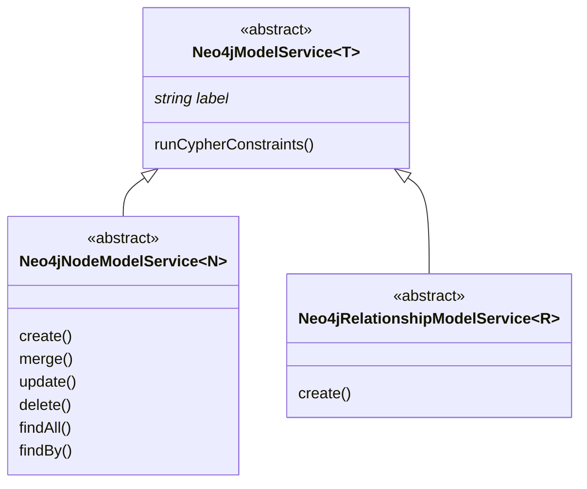

<a href="https://nhogs.com"></a>

# @nhogs/nestjs-neo4j

## Description

[Neo4j](https://neo4j.com/) module for [Nest.js](https://github.com/nestjs/nest).

[](https://github.com/Nhogs/nestjs-neo4j/actions/workflows/e2e-test.yml)
[](https://registry.hub.docker.com/layers/library/neo4j/5.2.0-enterprise/images/sha256-b43013f0cd7d74e1e4497d3756cdb7ccb1b8b219bad3407c58956e215ef3a56f?context=explore)
[](https://codeclimate.com/github/Nhogs/nestjs-neo4j/maintainability)
[](https://codeclimate.com/github/Nhogs/nestjs-neo4j/test_coverage)

### Peer Dependencies

[](https://github.com/nestjs/nest)
[](https://github.com/neo4j/neo4j-javascript-driver)

## Installation

[](https://www.npmjs.com/package/@nhogs/nestjs-neo4j)

```bash
$ npm i --save @nhogs/nestjs-neo4j
```

## Usage

### In static module definition:

```typescript
@Module({
  imports: [
    Neo4jModule.forRoot({
      scheme: 'neo4j',
      host: 'localhost',
      port: '7687',
      database: 'neo4j',
      username: 'neo4j',
      password: 'test',
      global: true, // to register in the global scope
    }),
    CatsModule,
  ],
})
export class AppModule {}
```

### In async module definition:

```typescript
@Module({
  imports: [
    Neo4jModule.forRootAsync({
      imports: [ConfigModule],
      inject: [ConfigService],
      useFactory: (configService: ConfigService): Neo4jConfig => ({
        scheme: configService.get('NEO4J_SCHEME'),
        host: configService.get('NEO4J_HOST'),
        port: configService.get('NEO4J_PORT'),
        username: configService.get('NEO4J_USERNAME'),
        password: configService.get('NEO4J_PASSWORD'),
        database: configService.get('NEO4J_DATABASE'),
      }),
      global: true,
    }),
    PersonModule,
    ConfigModule.forRoot({
      envFilePath: './test/src/.test.env',
    }),
  ],
})
export class AppAsyncModule {}
```

### [🔗 Neo4jService](/lib/service/neo4j.service.ts) :

```typescript
@Injectable()
/** See https://neo4j.com/docs/api/javascript-driver/current/ for details ...*/
export class Neo4jService implements OnApplicationShutdown {
  constructor(
    @Inject(NEO4J_CONFIG) private readonly config: Neo4jConfig,
    @Inject(NEO4J_DRIVER) private readonly driver: Driver,
  ) {}

  /** Verifies connectivity of this driver by trying to open a connection with the provided driver options...*/
  verifyConnectivity(options?: { database?: string }): Promise<ServerInfo> {...}

  /** Regular Session. ...*/
  getSession(options?: SessionOptions): Session {...}

  /** Reactive session. ...*/
  getRxSession(options?: SessionOptions): RxSession {...}

  /** Run Cypher query in regular session and close the session after getting results. ...*/
  run(
    query: Query,
    sessionOptions?: SessionOptions,
    transactionConfig?: TransactionConfig,
  ): Promise<QueryResult> {...}

  /** Run Cypher query in reactive session. ...*/
  rxRun(
    query: Query,
    sessionOptions?: SessionOptions,
    transactionConfig?: TransactionConfig,
  ): RxResult {...}

  /** Returns constraints as runnable Cypher queries defined with decorators on models. ...*/
  getCypherConstraints(label?: string): string[] {...}

  onApplicationShutdown() {
    return this.driver.close();
  }
}
```

```typescript
/**
 * Cat Service example
 */

@Injectable()
export class CatService {
  constructor(private readonly neo4jService: Neo4jService) {}

  async create(cat: Cat): Promise<Cat> {
    const queryResult = await this.neo4jService.run(
      {
        cypher: 'CREATE (c:`Cat`) SET c=$props RETURN properties(c) AS cat',
        parameters: {
          props: cat,
        },
      },
      { write: true },
    );

    return queryResult.records[0].toObject().cat;
  }

  async findAll(): Promise<Cat[]> {
    return (
      await this.neo4jService.run({
        cypher: 'MATCH (c:`Cat`) RETURN properties(c) AS cat',
      })
    ).records.map((record) => record.toObject().cat);
  }
}
```

### Run with reactive session

```typescript
neo4jService
  .rxRun({ cypher: 'MATCH (n) RETURN count(n) AS count' })
  .records()
  .subscribe({
    next: (record) => {
      console.log(record.get('count'));
    },
    complete: () => {
      done();
    },
  });
```

### Define constraints with decorators on Dto

https://neo4j.com/docs/cypher-manual/current/constraints/

- @NodeKey():
  - Node key constraints
- @Unique():
  - Unique node property constraints
- @NotNull():
  - Node property existence constraints
  - Relationship property existence constraints

[🔗 Constraint decorators - source code](/lib/decorator/constraint.decorator.ts)

```typescript
@Node({ label: 'Person' })
export class PersonDto {
  @NodeKey({ additionalKeys: ['firstname'] })
  name: string;

  @NotNull()
  firstname: string;

  @NotNull()
  @Unique()
  surname: string;

  @NotNull()
  age: number;
}

@Relationship({ type: 'WORK_IN' })
export class WorkInDto {
  @NotNull()
  since: Date;
}
```

Will generate the following constraints:

```cypher
CREATE CONSTRAINT `person_name_key` IF NOT EXISTS FOR (p:`Person`) REQUIRE (p.`name`, p.`firstname`) IS NODE KEY
CREATE CONSTRAINT `person_firstname_exists` IF NOT EXISTS FOR (p:`Person`) REQUIRE p.`firstname` IS NOT NULL
CREATE CONSTRAINT `person_surname_unique` IF NOT EXISTS FOR (p:`Person`) REQUIRE p.`surname` IS UNIQUE
CREATE CONSTRAINT `person_surname_exists` IF NOT EXISTS FOR (p:`Person`) REQUIRE p.`surname` IS NOT NULL
CREATE CONSTRAINT `person_age_exists` IF NOT EXISTS FOR (p:`Person`) REQUIRE p.`age` IS NOT NULL

CREATE CONSTRAINT `work_in_since_exists` IF NOT EXISTS FOR ()-[p:`WORK_IN`]-() REQUIRE p.`since` IS NOT NULL
```

### Extends Neo4j Model Services helpers to get basic CRUD methods for node or relationships:



See source code for more details:

- [🔗 Neo4jModelService](lib/service/neo4j.model.service.ts)
- [🔗 Neo4jNodeModelService](lib/service/neo4j.node.model.service.ts)
- [🔗 Neo4jRelationshipModelService](lib/service/neo4j.relationship.model.service.ts)

#### Examples:

Look at [🔗 E2e tests usage](spec/e2e) for more details

```typescript
/**
 * Cat Service example
 */

@Injectable()
export class CatsService extends Neo4jNodeModelService<Cat> {
  constructor(protected readonly neo4jService: Neo4jService) {
    super();
  }

  label = 'Cat';
  logger = undefined;

  fromNeo4j(model: Record<string, any>): Cat {
    return super.fromNeo4j({
      ...model,
      age: model.age.toNumber(),
    });
  }

  toNeo4j(cat: Record<string, any>): Record<string, any> {
    let result: Record<string, any> = { ...cat };

    if (!isNaN(result.age)) {
      result.age = int(result.age);
    }

    return super.toNeo4j(result);
  }

  // Add a property named 'created' with timestamp on creation
  protected timestamp = 'created';

  findByName(
    name: string,
    options?: {
      skip?: number;
      limit?: number;
      orderBy?: string;
      descending?: boolean;
    },
  ) {
    return super.findBy({ name }, options);
  }

  searchByName(
    name: string,
    options?: {
      skip?: number;
      limit?: number;
    },
  ) {
    return super.searchBy('name', name.split(' '), options);
  }
}
```

```typescript
/**
 * WORK_IN Controller example
 */

@Controller('WORK_IN')
export class WorkInController {
  constructor(
    private readonly personService: PersonService,
    private readonly workInService: WorkInService,
    private readonly companyService: CompanyService,
  ) {}

  @Post('/:from/:to')
  async workIn(
    @Param('from') from: string,
    @Param('to') to: string,
    @Body() workInDto: WorkInDto,
  ): Promise<[PersonDto, WorkInDto, CompanyDto][]> {
    return this.workInService
      .create(
        workInDto,
        { name: from },
        { name: to },
        this.personService,
        this.companyService,
      )
      .run();
  }

  @Get()
  async findAll(): Promise<[PersonDto, WorkInDto, CompanyDto][]> {
    return this.workInService.findAll();
  }
}
```

## License

[MIT licensed](LICENSE).
