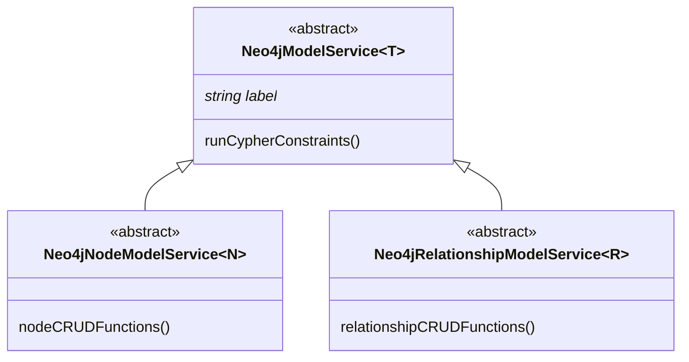

<a href="https://nhogs.com"></a>

# @nhogs/nestjs-neo4j

## Description

[Neo4j](https://neo4j.com/) module for [Nest.js](https://github.com/nestjs/nest).

[](https://github.com/Nhogs/nestjs-neo4j/actions/workflows/e2e-test.yml)
[](https://hub.docker.com/layers/neo4j/library/neo4j/4.4.8-enterprise/images/sha256-c6e315b42b260c81177c7ae5645e4fec5be7b0c9febada7d38df8cd698cd1a3b?context=explore)
[](https://codeclimate.com/github/Nhogs/nestjs-neo4j/maintainability)
[](https://codeclimate.com/github/Nhogs/nestjs-neo4j/test_coverage)

### Peer Dependencies

[](https://github.com/nestjs/nest)
[](https://github.com/neo4j/neo4j-javascript-driver)

## Installation

```bash
$ npm i --save @nhogs/nestjs-neo4j
```

## Table Of Content:

- [Usage](#usage)
  - [In static module definition:](#in-static-module-definition)
  - [In async module definition:](#in-async-module-definition)
  - [Use in service:](#use-in-service)
  - [Run with reactive session](#run-with-reactive-session)
  - [Define constraints with decorators:](#define-constraints-with-decorators)
  - [Extends Neo4jModelService helpers to get CRUD methods for node or relationships:](#extends-neo4jmodelservice-helpers-to-get-crud-methods-for-node-or-relationships)
    - [Examples:](#examples)

## Usage

### In static module definition:

```typescript
@Module({
  imports: [
    Neo4jModule.forRoot({
      scheme: 'neo4j',
      host: 'localhost',
      port: '7687',
      database: 'neo4j',
      username: 'neo4j',
      password: 'test',
      global: true,
    }),
    CatsModule,
  ],
})
export class AppModule {}
```

### In async module definition:

```typescript
@Module({
  imports: [
    Neo4jModule.forRootAsync({
      imports: [ConfigModule],
      inject: [ConfigService],
      useFactory: (configService: ConfigService): Neo4jConfig => ({
        scheme: configService.get('NEO4J_SCHEME'),
        host: configService.get('NEO4J_HOST'),
        port: configService.get('NEO4J_PORT'),
        username: configService.get('NEO4J_USERNAME'),
        password: configService.get('NEO4J_PASSWORD'),
        database: configService.get('NEO4J_DATABASE'),
      }),
      global: true,
    }),
    PersonModule,
    ConfigModule.forRoot({
      envFilePath: './test/src/.test.env',
    }),
  ],
})
export class AppAsyncModule {}
```

### Use in service:

```typescript
@Injectable()
export class CatService {
  constructor(private readonly neo4jService: Neo4jService) {}

  async create(cat: Cat): Promise<Cat> {
    const result = await this.neo4jService.run(
      {
        cypher: 'CREATE (c:`Cat`) SET c=$props RETURN properties(c) AS cat',
        parameters: {
          props: cat,
        },
      },
      { write: true },
    );

    return result.records[0].toObject().cat;
  }

  async findAll(): Promise<Cat[]> {
    return (
      await this.neo4jService.run({
        cypher: 'MATCH (c:`Cat`) RETURN properties(c) AS cat',
      })
    ).records.map((record) => record.toObject().cat);
  }
}
```

### Run with reactive session

```typescript
neo4jService
  .rxRun({ cypher: 'MATCH (n) RETURN count(n) AS count' })
  .records()
  .subscribe({
    next: (record) => {
      console.log(record.get('count'));
    },
    complete: () => {
      done();
    },
  });
```

### Define constraints with decorators:

```typescript
@Node({ label: 'Person' })
export class PersonDto {
  @ConstraintKey({
    name: 'person_node_key',
    additionalKeys: ['firstname'],
    ifNotExists: true,
  })
  name: string;

  @ConstraintNotNull({
    ifNotExists: true,
  })
  firstname: string;

  @ConstraintUnique({
    name: 'surname_is_unique',
    ifNotExists: true,
  })
  surname: string;

  @ConstraintNotNull({
    name: 'person_name_exists',
    ifNotExists: true,
  })
  age: number;
}
```

Will generate the following constraints:

```cypher
CREATE CONSTRAINT `person_node_key` IF NOT EXISTS FOR (p:`Person`) REQUIRE (p.`name`, p.`firstname`) IS NODE KEY;
CREATE CONSTRAINT IF NOT EXISTS FOR (p:`Person`) REQUIRE p.`firstname` IS NOT NULL;
CREATE CONSTRAINT `surname_is_unique` IF NOT EXISTS FOR (p:`Person`) REQUIRE p.`surname` IS UNIQUE;
CREATE CONSTRAINT `person_name_exists` IF NOT EXISTS FOR (p:`Person`) REQUIRE p.`age` IS NOT NULL;
```

### Extends Neo4jModelService helpers to get CRUD methods for node or relationships:



See source code for more details:

- [Neo4jModelService](lib/service/neo4j.model.service.ts)
- [Neo4jNodeModelService](lib/service/neo4j.node.model.service.ts)
- [Neo4jRelationshipModelService](lib/service/neo4j.relationship.model.service.ts)

#### Examples:

Look at [E2e tests usage](test) for more details

```typescript
/**
 * Cat Service example
 */

@Injectable()
export class CatsService extends Neo4jNodeModelService<Cat> {
  constructor(protected readonly neo4jService: Neo4jService) {
    super();
  }

  label = 'Cat';

  fromNeo4j(model: Record<string, any>): Cat {
    return {
      ...model,
      age: model.age.toNumber(),
      created: model.created.toString(),
    } as Cat;
  }

  toNeo4j(cat: Record<string, any>): Record<string, any> {
    let result: Record<string, any> = { ...cat };

    if (!isNaN(result.age)) {
      result.age = int(result.age);
    }

    return result;
  }

  // Add a property named 'created' with timestamp on creation
  protected timestamp = 'created';

  async findByName(params: {
    name: string;
    skip?: number;
    limit?: number;
    orderBy?: string;
    descending?: boolean;
  }): Promise<Cat[]> {
    return super.findBy({
      props: { name: params.name },
      ...params,
    });
  }

  async searchByName(params: {
    search: string;
    skip?: number;
    limit?: number;
  }): Promise<[Cat, number][]> {
    return super.searchBy({
      prop: 'name',
      terms: params.search.split(' '),
      skip: params.skip,
      limit: params.limit,
    });
  }
}
```

## License

[MIT licensed](LICENSE).
